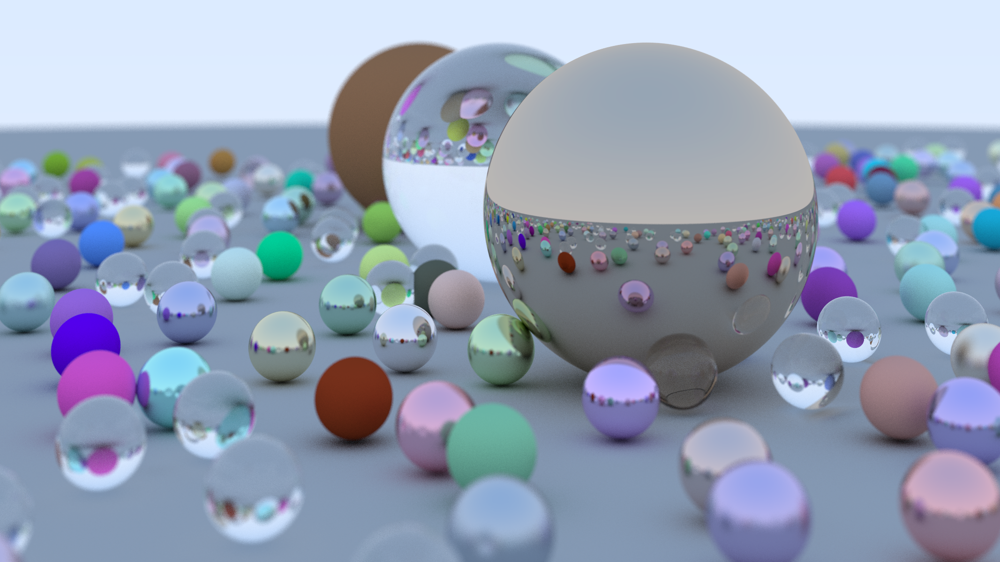

# Raytracer

A basic raytracer implementation in Rust based on the [_Ray Tracing in One Weekend_](https://raytracing.github.io/books/RayTracingInOneWeekend.html) book.

## Result



# How to Run

## Standalone Binary

```bash
$ cargo run
```

The above command will produce a `test.ppm` file in the same directory containing the rendered image.

## WASM port for the Web

Install [wasm-pack](https://rustwasm.github.io/wasm-pack/installer/). Then run the following commands.

```bash
$ wasm-pack build
$ cd www
$ npm run start
```

This will be hosted on github pages soon.

## Adjusting the objects or camera

At this point, any changes to the scene has to be made directly inside the code. If you wish to modify the scene start with `bin.rs` and `lib.rs`.